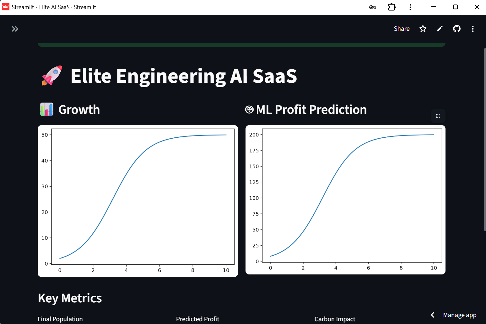

<h1 align="center">🚀 Elite Engineering AI SaaS</h1>
<p align="center">
  AI-powered SaaS platform transforming [Engineering]
</p>

<p align="center">
  
  
  
  
  
</p>

---

## 🌐 Live Demo
👉 [Try the App](https://elite-engineering-suite-wfuewditrdkzashsdia7tp.streamlit.app/)

---

## 🎥 Demo Preview


# elite-ai-saas
AI-powered engineering optimization SaaS with ML, cost modeling, and carbon analytics
# 🚀 Elite AI SaaS

AI-powered engineering optimization platform with:
- 📊 Growth simulation
- 🤖 Machine learning predictions
- 💰 Cost modeling
- 🌱 Carbon impact analytics
- 🔐 User authentication (SaaS-ready)

---

## 🧠 Features

- Logistic growth modeling
- ML-based profit prediction (scikit-learn)
- Real-time dashboards
- SQLite user system
- Clean Streamlit UI

---

## ⚙️ Tech Stack

- Python
- Streamlit
- NumPy / SciPy
- Scikit-learn
- SQLite


---

# ✨ 2. Add Animations & Premium Touch

### 🔹 Typing Animation Header
Add this at the top:

```md
<p align="center">
  
</p>

---

## ✨ Features

- 🔐 Secure Authentication (JWT / OAuth)
- 🧠 Real Machine Learning (not brute force)
- ⚡ Lightning-fast UI (Next.js / React)
- 📊 Smart analytics dashboard
- ☁️ Cloud-native deployment

---

## 🧠 Tech Stack

```bash
Frontend: Next.js / React / Tailwind
Backend: Node.js / Express
Database: MongoDB / PostgreSQL
ML: Python (Scikit-learn / TensorFlow)
Deployment: Vercel / AWS / Docker
---

## 🚀 Run Locally

```bash
pip install -r requirements.txt
streamlit run dashboard_app.py

🎯 Vision

To become the AI decision engine for sustainable engineering systems.

👤 Author

Your Lyton Mupanga
